<table width="100%">
  <tr>
    <!-- CỘT TRÁI: Ảnh ASCII -->
    <td valign="top" width="45%">
      

        <h3><code>duy@github ~ $ whoami</code></h3>
        
      

    </td>
    
    <!-- CỘT PHẢI: Thông tin cá nhân & Kỹ năng -->
    <td valign="top" width="55%">
      <h1>Hi 👋, I'm Duy Đoàn Đức</h1>
      <h3>Using AI more every day</h3>
      
      <ul>
        <li>🌱 I’m currently learning <b>Vibe coding, data</b></li>
        <li>💬 Ask me about <b>Python, AI</b></li>
        <li>📫 How to reach me <b>doanducduy12345@gmail.com</b></li>
      </ul>
      
      <h3>Connect with me:</h3>
      

        
        
        
      

      
      <h3>Languages and Tools:</h3>
      

        
        
        
        
        
        
        
        
        
        
        
        
        
        
        
        
        
      

    </td>
  </tr>
</table>
